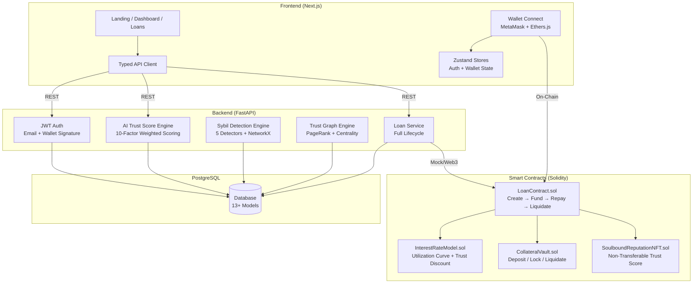
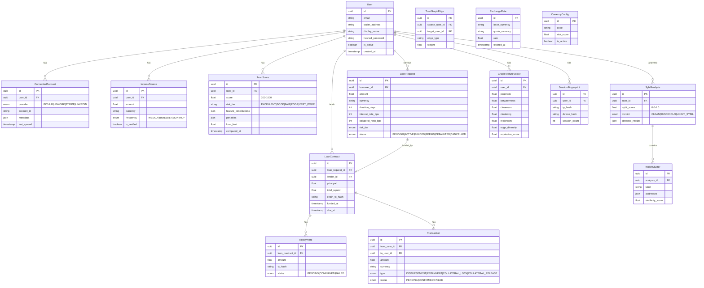

# CreDeFi — System Architecture & Schema

## System Architecture



## Database Schema



## AI Trust Score Engine — Scoring Pipeline

```
┌─────────────────────────────────────────────────────────────┐
│                    RAW DATA SOURCES                         │
│  Connected Accounts · Income · Wallet · Loan History        │
└────────────────────────┬────────────────────────────────────┘
                         ▼
┌─────────────────────────────────────────────────────────────┐
│               FEATURE EXTRACTION (10 Factors)               │
│                                                             │
│  Loan Reliability .... 16%    Platform Quality .... 10%     │
│  Income .............. 13%    Wallet Age .......... 8%      │
│  Income Stability .... 12%    Tx Diversity ........ 6%      │
│  Graph Reputation .... 12%    Growth Trend ........ 6%      │
│  Currency Risk ....... 12%    Account Behavior .... 5%      │
└────────────────────────┬────────────────────────────────────┘
                         ▼
┌─────────────────────────────────────────────────────────────┐
│                  ANTI-FRAUD PENALTIES                        │
│                                                             │
│  • Circular transaction detection                           │
│  • Sybil verdict penalty (0.5x multiplier)                  │
│  • Velocity change penalty                                  │
│  • Score decay over time                                    │
│  • Gaming pattern detection                                 │
└────────────────────────┬────────────────────────────────────┘
                         ▼
┌─────────────────────────────────────────────────────────────┐
│              SIGMOID MAPPING → 300–1000 SCORE               │
│                                                             │
│  300 ████░░░░░░░░░░░░░░░░░░░░░░░░░░░░░░░░░░░░░░░░░░ 1000  │
│      VERY_POOR  POOR   FAIR    GOOD    EXCELLENT            │
└────────────────────────┬────────────────────────────────────┘
                         ▼
┌─────────────────────────────────────────────────────────────┐
│                    OUTPUT                                    │
│  Score: 782 │ Tier: EXCELLENT │ Loan Limit: $50,000         │
└─────────────────────────────────────────────────────────────┘
```

## Smart Contract Interaction Flow

```
Borrower                    LoanContract              CollateralVault
   │                             │                          │
   │  1. createLoan()            │                          │
   │────────────────────────────▶│   lock collateral        │
   │                             │─────────────────────────▶│
   │                             │                          │
   │         Lender              │                          │
   │           │  2. fundLoan()  │                          │
   │           │────────────────▶│                          │
   │  ◀────── │ principal sent   │                          │
   │                             │                          │
   │  3. repay()                 │                          │
   │────────────────────────────▶│                          │
   │           │  ◀──────────────│ repayment to lender      │
   │                             │                          │
   │  (if fully repaid)          │   unlock collateral      │
   │  ◀─────────────────────────│─────────────────────────▶│
   │                             │                          │
   │  (if defaulted)  Liquidator │                          │
   │                    │  4. liquidate()                    │
   │                    │───────▶│   seize + bonus          │
   │                    │  ◀─────│──────────────────────────▶│
```
